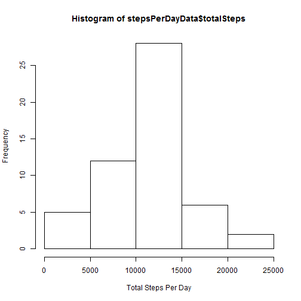
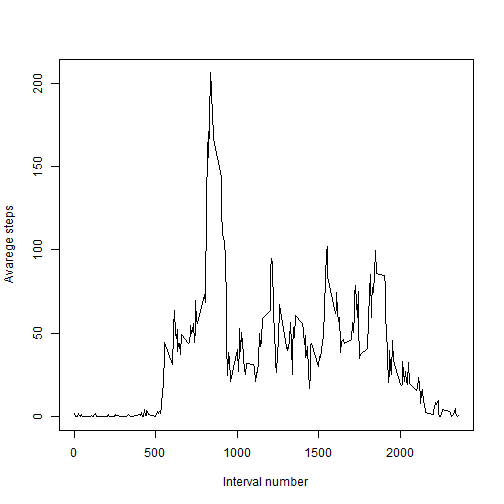
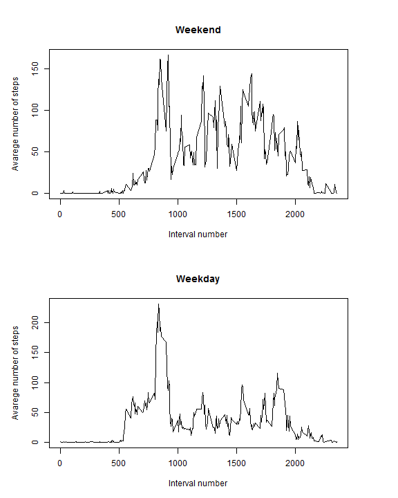

# Analysis of automatically collected personal movement data

This code is assumed to be run in the same directory where activity.zip is located. It could be accomplished by setting working directory to the path with containing this code:

setwd("coding/datasciencecoursera/RepData_PeerAssessment1/")


## Loading required libraries


## Loading and preprocessing the data

### Reading raw and purified data from the zipped csv. rawData is raw in a sence that it does contain NA values. 


```r
fileConnection <- unz("activity.zip", "activity.csv")
rawData <- read.csv(fileConnection)
data <- mutate(rawData, date = ymd(date))
purifiedData <- filter(data, !is.na(steps))
head(purifiedData)
```

```
##   steps       date interval
## 1     0 2012-10-02        0
## 2     0 2012-10-02        5
## 3     0 2012-10-02       10
## 4     0 2012-10-02       15
## 5     0 2012-10-02       20
## 6     0 2012-10-02       25
```

## What is a mean total number of steps taken per day?


```r
groupedByDay <- group_by(purifiedData, date)
stepsPerDayData <- summarize(groupedByDay, totalSteps = sum(steps))
hist(stepsPerDayData$totalSteps, xlab = "Total Steps Per Day")
```

 

```r
stepsPerDayMedian <- median(stepsPerDayData$totalSteps)
stepsPerDayMean <- mean(stepsPerDayData$totalSteps)
```

Mean of total steps taken per day is 10766.  
Median of total steps taken per day is 10765.


## What is the average daily activity pattern?


```r
groupedByInterval <- group_by(purifiedData, interval)
averageStepsPerInterval <- summarize(groupedByInterval, avgSteps = mean(steps))

plot(x = range(averageStepsPerInterval$interval), 
     y = range(averageStepsPerInterval$avgSteps),
     type = "n",
     xlab = "Interval number",
     ylab = "Avarege steps")

lines(x = averageStepsPerInterval$interval, 
      y = averageStepsPerInterval$avgSteps)
```

 

```r
rowWithMaxAvgSteps <- averageStepsPerInterval[which.max(averageStepsPerInterval$avgSteps),]
head(rowWithMaxAvgSteps)
```

```
## Source: local data frame [1 x 2]
## 
##   interval avgSteps
##      (int)    (dbl)
## 1      835 206.1698
```

Interval #835 has the maximum number of steps(206) in average across all dates.

## Imputing missing values


```r
numberOfMissingValues <- nrow(filter(rawData, is.na(steps)))
```

Number of missing values in the data set is 2304 out of 17568.

To populate the missing values we'll use mean for 5-minutes interval calculated in the Part #2.


```r
tmp <- as.data.frame(averageStepsPerInterval)
fixedData <- data %>% rowwise() %>% mutate(steps = ifelse(is.na(steps), tmp[tmp$interval %in% interval, "avgSteps"], as.numeric(steps)))

head(rawData)
```

```
##   steps       date interval
## 1    NA 2012-10-01        0
## 2    NA 2012-10-01        5
## 3    NA 2012-10-01       10
## 4    NA 2012-10-01       15
## 5    NA 2012-10-01       20
## 6    NA 2012-10-01       25
```

```r
head(fixedData)
```

```
## Source: local data frame [6 x 3]
## 
##       steps       date interval
##       (dbl)     (time)    (int)
## 1 1.7169811 2012-10-01        0
## 2 0.3396226 2012-10-01        5
## 3 0.1320755 2012-10-01       10
## 4 0.1509434 2012-10-01       15
## 5 0.0754717 2012-10-01       20
## 6 2.0943396 2012-10-01       25
```

```r
hist(stepsPerDayData$totalSteps, xlab = "Total Steps Per Day")
```

 

```r
groupedByDay <- group_by(fixedData, date)
fixedStepsPerDayData <- summarize(groupedByDay, totalSteps = sum(steps))
fixedStepsPerDayMedian <- median(fixedStepsPerDayData$totalSteps)
fixedStepsPerDayMean <- mean(fixedStepsPerDayData$totalSteps)
```

Mean of total steps taken per day is 10766.
Median of total steps taken per day is 10766.

As we see imputing data doesn't significantly change the calculations results.


## Are there differences in activity patterns between weekdays and weekends?


```r
getDayType <- function(date) { 
  weekDay <- weekdays(date)
  return(ifelse(weekDay == "Sunday" || weekDay == "Saturday", "weekend", "weekday"))
}

fixedData <- mutate(fixedData, dayType = getDayType(date))
fixedData$dayType <- as.factor(fixedData$dayType)
```

Let's create a panel plot


```r
groupedByIntervalForWeekDays <- group_by(fixedData[fixedData$dayType == "weekday",], interval)
groupedByIntervalForWeekEnds <- group_by(fixedData[fixedData$dayType == "weekend",], interval)

averageStepsPerIntervalWeekDays <- summarize(groupedByIntervalForWeekDays, avgSteps = mean(steps))
averageStepsPerIntervalWeekEnds <- summarize(groupedByIntervalForWeekEnds, avgSteps = mean(steps))

par(mfrow = c(2, 1), pin = c(6, 3))

# Plot for weekend intervals
plot(x = range(averageStepsPerIntervalWeekEnds$interval), 
     y = range(averageStepsPerIntervalWeekEnds$avgSteps),
     main = "Weekend",
     type = "n",
     xlab = "Interval number",
     ylab = "Avarege number of steps")

lines(x = averageStepsPerIntervalWeekEnds$interval, 
      y = averageStepsPerIntervalWeekEnds$avgSteps)


# Plot for weekdays intervals
plot(x = range(averageStepsPerIntervalWeekDays$interval), 
     y = range(averageStepsPerIntervalWeekDays$avgSteps),
     main = "Weekday",
     type = "n",
     xlab = "Interval number",
     ylab = "Avarege number of steps")

lines(x = averageStepsPerIntervalWeekDays$interval, 
      y = averageStepsPerIntervalWeekDays$avgSteps)
```

 

As we see on the weekends steps number distribution is more spread along the day, while on weekdays the most part of steps is done in the first middle of the day.

